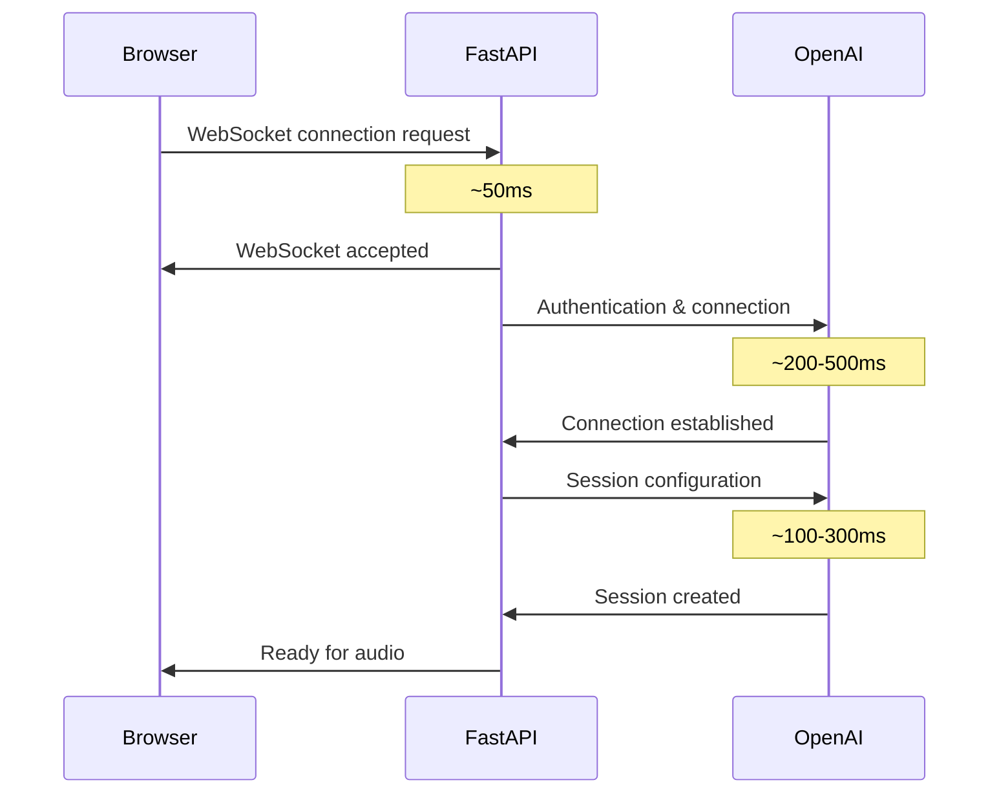

# Speech-to-Text Chatbot

A FastAPI application that provides real-time speech-to-speech conversations using OpenAI's Realtime API.

## How It Works?

### 1. Frontend Interface (`chatbot.html`)

#### Real-Time Audio Streaming

The frontend captures and streams audio using modern Web APIs:

```javascript
// Captures microphone input at 16kHz, 16-bit PCM format
const audioContext = new AudioContext({ sampleRate: 16000 });
const processor = audioContext.createScriptProcessor(1024, 1, 1);

// Converts audio to base64 and streams to backend
processor.onaudioprocess = function(event) {
    const audioData = convertFloat32ToInt16(inputBuffer);
    const base64Audio = btoa(String.fromCharCode(...new Uint8Array(audioData.buffer)));
    
    ws.send(JSON.stringify({
        type: "input_audio_buffer.append",
        audio: base64Audio
    }));
};
```

#### WebSocket Communication

- Establishes persistent connection to `/ws/realtime` endpoint
- Sends real-time audio chunks as base64-encoded PCM data
- Receives and handles various message types from OpenAI API
- Provides visual feedback for recording, processing, and speech detection

### 2. Backend API (`main.py`)

#### WebSocket Proxy Architecture

The backend acts as a secure proxy between the client and OpenAI's Realtime API:

```python
class RealtimeConnection:
    async def connect_to_openai(self):
        # Establishes WebSocket connection to OpenAI Realtime API
        headers = {
            "Authorization": f"Bearer {OPENAI_API_KEY}",
            "OpenAI-Beta": "realtime=v1"
        }
        
        self.openai_ws = await websockets.connect(
            OPENAI_REALTIME_URL, extra_headers=headers
        )
```

#### Session Configuration

Configures the AI assistant with optimal settings for real-time conversation:

```python
session_config = {
    "type": "session.update",
    "session": {
        "modalities": ["text", "audio"],
        "instructions": "You are a helpful assistant. Be concise and natural.",
        "voice": "alloy",
        "input_audio_format": "pcm16",
        "output_audio_format": "pcm16",
        "input_audio_transcription": {"model": "gpt-4o-mini-transcribe"},
        "turn_detection": {
            "type": "server_vad",  # Server-side Voice Activity Detection
            "threshold": 0.5,
            "prefix_padding_ms": 300,
            "silence_duration_ms": 500
        }
    }
}
```

## Process Flow



## Installation

```bash
# Clone the repository
git clone https://github.com/sujeethshingade/speech-to-text.git
cd speech-to-text/fastapi/realtime

# Create virtual environment
python -m venv venv
venv\Scripts\activate  # Windows

python3 -m venv venv
source venv/bin/activate  # macOS/Linux

# Install dependencies
pip install -r requirements.txt

# Set up environment variables
copy .env.example .env   # Edit .env and add your OPENAI_API_KEY

# Run the application
python main.py
```

The application will be available at: <http://localhost:8000>

## References

- [OpenAI Realtime API Documentation](https://platform.openai.com/docs/guides/realtime)
- [WebSocket API Reference](https://platform.openai.com/docs/api-reference/realtime)
- [FastAPI WebSocket Guide](https://fastapi.tiangolo.com/advanced/websockets/)
