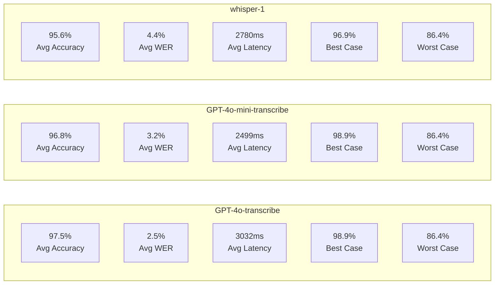

# Speech-to-Text Chatbot

A modern speech-to-text chatbot application built with Next.js frontend and Flask backend, offering both local Whisper model processing and OpenAI API integration for accurate speech recognition.

## Interface Overview

### Navbar Options

The top navigation bar provides two main configuration sections:

#### 1. Processing Method Selection

- **Local**: Uses your computer's Whisper model (offline processing)
- **API**: Uses OpenAI's cloud-based transcription services

#### 2. Model Selection

**When "Local" is Selected:**

- **Tiny**: Fastest local model with basic accuracy (`tiny`)

**When "API" is Selected:**

- **Whisper**: Standard OpenAI Whisper API model (`whisper-1`)
- **GPT-4o**: Advanced transcription with GPT-4o (`gpt-4o-transcribe`)
- **GPT-4o mini**: Lighter version of GPT-4o transcription (`gpt-4o-mini-transcribe`)

## How It Works - Complete Process

### Step-by-Step: From Recording to Text

#### 1. **Start Recording**

- Click the microphone button in the input area
- Browser requests microphone permissions (allow when prompted)
- "Recording" indicator appears above the input

#### 2. **Audio Capture**

- Your voice is captured in real-time
- Audio data is collected in small chunks
- No data is sent to servers during recording

#### 3. **Stop Recording**

- Click the red microphone button again
- Recording stops immediately
- Audio chunks are combined into a single file

#### 4. **Processing Begins**

- Input placeholder shows processing status
- All controls are temporarily disabled during processing

#### 5. **Audio File Handling**

- Audio is converted to WebM format
- Maximum file size: 25MB
- Temporary file created for processing

#### 6. **Transcription Route Selection**

**Local Processing Path:**

- Audio sent to `/api/transcribe-local`
- Request forwarded to Flask backend at `http://127.0.0.1:5328/api/transcribe`
- Uses locally installed Whisper "tiny" model
- Completely Offline - Open Source

**API Processing Path:**

- Audio sent to `/api/transcribe-api`
- Temporary file created on server
- Sent to OpenAI's transcription service with selected model

#### 7. **Model Processing**

**Local:**

The application uses the "tiny" Whisper model by default for faster processing. You can change this in `api/index.py`:

```python
model = whisper.load_model("tiny") # tiny, base, small, medium, large, turbo
result = model.transcribe(audio_file)
```

For more details about the different model sizes and their performance characteristics, view [Whisper Model Card](https://github.com/openai/whisper/blob/main/model-card.md).

**API:**

```javascript
transcription = openai.audio.transcriptions.create(
    file=audio_file,
    model=selected_model,  // whisper-1, gpt-4o-transcribe, gpt-4o-mini-transcribe
    response_format="text"
)
```

For more details about the different models, view [Whisper](https://platform.openai.com/docs/models/whisper-1), [GPT-4o Transcribe](https://platform.openai.com/docs/models/gpt-4o-transcribe), [GPT-4o mini Transcribe](https://platform.openai.com/docs/models/gpt-4o-mini-transcribe).

#### 8. **Text Response**

- Server returns transcribed text
- Temporary files are automatically cleaned up
- Processing indicator disappears

#### 9. **Text Appears in Input**

- Transcribed text automatically populates the input field
- If there's existing text, new text is appended with a space
- You can edit the text before sending

## Evaluation Metrics

These values are based on 25 WAV files (each containing approximately 40 seconds of English speech) that were transcribed using these models.



## Installation

### 1. Clone the Repository

```bash
git clone https://github.com/sujeethshingade/speech-to-text.git
cd speech-to-text/nextjs
```

### 2. Set up Virtual Environment

#### Windows

```bash
python -m venv venv
venv\Scripts\activate
```

#### macOS/Linux

```bash
python3 -m venv venv
source venv/bin/activate
```

### 3. Install Dependencies

```bash
pip install -r requirements.txt
npm install
```

### 4. Environment Configuration

Create a `.env.local` file in the root directory:

```env
# OpenAI API Key for Whisper API transcription
OPENAI_API_KEY=your_openai_api_key_here

# Next.js API URL (for internal API routes)
NEXT_PUBLIC_API_URL=http://localhost:3000
```

### 5. Running the Application

```bash
npm run dev
```

The application will be available at `http://localhost:3000`

## References

- [OpenAI Whisper](https://openai.com/index/whisper/)
- [Whisper GitHub Repository](https://github.com/openai/whisper)
- [Whisper Research Paper](https://cdn.openai.com/papers/whisper.pdf)
- [OpenAI Speech-to-Text Documentation](https://platform.openai.com/docs/guides/speech-to-text)
